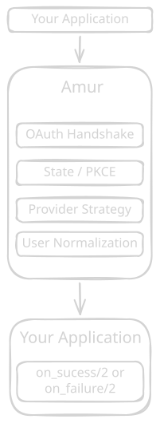

# Amur

Simple [OAuth](https://auth0.com/intro-to-iam/what-is-oauth-2) for Plug applications.

Amur gives Plug applications a small, provider agnostic OAuth flow without requiring Phoenix. It handles the OAuth handshake, state/[PKCE](https://auth0.com/docs/get-started/authentication-and-authorization-flow/authorization-code-flow-with-pkce), provider specific configuration, and user normalization. All of this while leaving authentication and user data management up to your application.

- Plug-native, works with Phoenix or standalone Plug
- State & PKCE, handled automatically
- Stateless by default, temporary OAuth state is cleared from session after the callback
- 24 built-in [providers](#built-in-providers)
- Normalized users, the same data format across providers
- Custom providers, add providers that aren't built in
- Igniter, get started in under 60 seconds
- Built on Assent, OAuth strategies are provided by [Assent](https://hex.pm/packages/assent)

## Why Amur?

Amur sits between your router and your OAuth provider:



Amur doesn't create users, manage sessions or impose any authentication systems on your application. It gives you the OAuth result and you decide what happens next.

## Quick Start - [Igniter](https://igniter.hexdocs.pm/readme.html) (Recommended)

```elixir
def deps do
  [
    {:igniter, "~> 0.8"}
  ]
end
```

```bash
# Defaults to GitHub
mix igniter.install amur --provider <Your Provider>
```

Options:

| Flag | Description |
|---|---|
| `--provider <name>` | Provider atom used in the generated config (default: `github`), look here for the list of [providers](#built-in-providers) |
| `--all` | Generate config for every built-in provider (cannot be combined with `--provider`) |
| `--app <name>` | Override the detected app name |
| `--no-config` / `--no-router` / `--no-controller` | Skip individual pieces |

Add your secrets into a .env:

```
GITHUB_CLIENT_ID=<ID>
GITHUB_CLIENT_SECRET=<SECRET>
```

That's it for basic setup of Amur.

## Built-in providers

Amur ships with support for the following providers:

- [Apple](https://developer.apple.com/documentation/signinwithapple),
- [Auth0](https://auth0.com/docs/get-started/auth0-overview/create-applications)
- [Azure AD](https://learn.microsoft.com/en-us/entra/identity-platform/quickstart-register-app)
- [Basecamp](https://github.com/basecamp/bc3-api/blob/master/sections/authentication.md)
- [Bitbucket](https://support.atlassian.com/bitbucket-cloud/docs/use-oauth-on-bitbucket-cloud/)
- [DigitalOcean](https://docs.digitalocean.com/reference/api/oauth/)
- [Discord](https://discord.com/developers/docs/topics/oauth2)
- [Facebook](https://developers.facebook.com/documentation/facebook-login)
- [GitHub](https://docs.github.com/en/apps/oauth-apps/building-oauth-apps/creating-an-oauth-app)
- [GitLab](https://docs.gitlab.com/ee/integration/oauth_provider.html)
- [Google](https://developers.google.com/identity/protocols/oauth2)
- [Hack Club](https://auth.hackclub.com/docs/oauth-guide)
- [Instagram](https://developers.facebook.com/docs/instagram-basic-display-api/getting-started)
- [LINE](https://developers.line.biz/en/docs/line-login/integrate-line-login/)
- [LinkedIn](https://learn.microsoft.com/en-us/linkedin/consumer/integrations/self-serve/sign-in-with-linkedin-v2)
- [Slack](https://api.slack.com/authentication/oauth-v2)
- [Spotify](https://developer.spotify.com/documentation/web-api/concepts/authorization)
- [Strava](https://developers.strava.com/docs/authentication/)
- [Stripe](https://docs.stripe.com/stripe-apps/api-authentication/oauth)
- [Telegram](https://core.telegram.org/widgets/login)
- [Twitch](https://dev.twitch.tv/docs/authentication/)
- [Twitter (X)](https://docs.x.com/fundamentals/authentication/oauth-2-0/authorization-code)
- [VK](https://docs.strapi.io/cms/configurations/users-and-permissions-providers/vk)
- [Zitadel](https://zitadel.com/docs/examples/identity-proxy/oauth2-proxy)


Each is a thin wrapper around the corresponding [Assent](https://github.com/pow-auth/assent) strategy.

## Custom providers

You can define your own provider module using the `Amur.Provider` behaviour:

```elixir
defmodule MyApp.Auth.CustomProvider do
  use Amur.Provider

  @impl true
  def strategy, do: Assent.Strategy.OAuth2

  @impl true
  def base_config do
    [
      base_url: "https://api.example.com",
      authorization_endpoint: "/oauth/authorize",
      token_endpoint: "/oauth/token",
      user_endpoint: "/user"
    ]
  end

  @impl true
  def normalize_user(user) do
    %{uid: user["id"], email: user["email"], name: user["name"]}
  end
end
```

Then reference it in your config:

```elixir
config :amur,
  providers: [
    my_provider: MyApp.Auth.CustomProvider
  ]
```

## Scopes

When the default scope isn't fit for your needs you can use a custom scope to get exactly whats needed. To request specific OAuth scopes, pass them in your provider config:

```elixir
config :amur,
  providers: [
    github: [
      client_id: "..",
      client_secret: "..",
      scopes: "user:email,read:org"
    ]
  ]
```

## In-depth Setup, (Not Required if used igniter)

This is what igniter sets up for you automatically.

### 1. Configure your OAuth providers

```elixir
# config/runtime.exs
config :amur,
  base_url: System.get_env("BASE_URL") || "http://localhost:4000",
  providers: [
    github: [
      client_id: System.fetch_env!("GITHUB_CLIENT_ID"),
      client_secret: System.fetch_env!("GITHUB_CLIENT_SECRET")
    ]
  ],
  on_success: &MyAppWeb.AuthController.on_success/2,
  on_failure: &MyAppWeb.AuthController.on_failure/2
```

| Key | Required | Description |
|---|---|---|
| `base_url` | no | Base URL used to build the `redirect_uri` (`#{base_url}/auth/:provider/callback`). Defaults to `""`. |
| `providers` | yes | Keyword list of provider configurations. Each key is a provider name, each value is either a keyword list of credentials or a custom provider module. |
| `on_success` | yes | A `{module, function, args}` MFA tuple or a function capture of arity 2, called with `(conn, %{user: normalized_user, token: token})`. |
| `on_failure` | no | Same format as `on_success`, called with `(conn, reason)`. Defaults to a redirect to `/`. |

### 2. Mount the router

```elixir
# Phoenix
scope "/auth", alias: false do
  pipe_through :browser
  forward "/", Amur.Router
end
```

The `alias: false` on the scope is required, without it Phoenix rewrites `Amur.Router` as `YourAppWeb.Amur.Router`.

Inside a browser pipeline, session and flash helpers are available for your callbacks.

Amur works with `Plug.Router` too:

```elixir
# Plug
forward "/auth", to: Amur.Router
```

The router exposes three endpoints:

| Endpoint | Description |
|---|---|
| `GET /auth/:provider` | Initiates the OAuth flow |
| `GET /auth/:provider/callback` | Handles the provider callback |

Amur stores the OAuth handshake params (the `state`, PKCE verifier, ...) in
the session for the duration of the flow and clears them automatically once
the callback has been handled, no manual cleanup needed.

### 3. Add an auth controller

Implement the `Amur.Callback` behaviour so both OAuth result handlers are
present and their arguments are type checked:

```elixir
defmodule MyAppWeb.AuthController do
  @behaviour Amur.Callback

  import Plug.Conn
  import Phoenix.Controller

  @impl true
  def on_success(conn, %{user: user}) do
    conn
    |> put_flash(:info, "Logged in as #{user.email}")
    |> redirect(to: "/")
    |> halt()
  end

  @impl true
  def on_failure(conn, reason) do
    conn
    |> put_flash(:error, "Authentication failed")
    |> redirect(to: "/")
    |> halt()
  end
end
```

The normalized `user` map has the following shape:

```elixir
%{
  provider: "github",      # the provider atom as a string
  uid: "12345",            # provider-specific user ID
  email: "user@example.com",
  name: "username",
  avatar: "https://..."
}
```

Different providers may return different fields. See each provider module's `normalize_user/1` for the exact shape.

`on_success/2` also receives the OAuth `token` in the same map. Bind it only
when you need it (for example, to call the provider's API on the user's
behalf); otherwise ignore it by pattern-matching just `:user`:

```elixir
def on_success(conn, %{user: user, token: token}) do
  conn
  |> put_session(:access_token, token["access_token"])
  |> redirect(to: "/")
  |> halt()
end
```

The token map's keys depend on the provider's flow: OAuth 2.0 providers use
`token["access_token"]`, while OAuth 1.0 (Twitter) uses `token["oauth_token"]`
and `token["oauth_token_secret"]`.

## License

MIT
